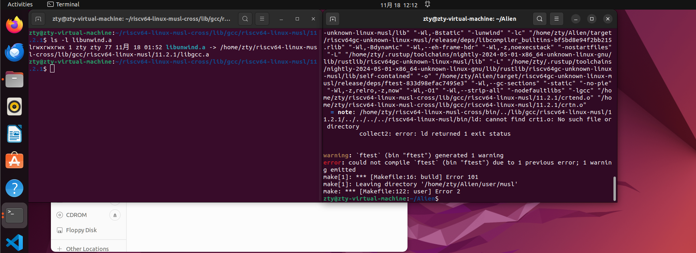

# -基于 jammdb 数据库的高性能、高可靠的异步文件系统-
### 2024/12/27
zty@zty-virtual-machine:~/riscv64-linux-musl-cross/lib/gcc/riscv64-linux-musl/11.2.1$ ln -s /home/zty/riscv64-linux-musl-cross/lib/gcc/riscv64-linux-musl/11.2.1/libgcc.a /home/zty/riscv64-linux-musl-cross/lib/gcc/riscv64-linux-musl/11.2.1/libunwind.a

在复现alien过程中遇到如果这样子还是不能运行，可以尝试把第四行注释掉这样就不会编译标准库的用户程序了，就能正常运行了，可以看下面这个图

user:

	@echo "Building user apps"

	@make all -C ./user/apps

	@make all -C ./user/c_apps ARCH=riscv64

	# @make all -C ./user/musl

	@echo "Building user apps done"

### 2024/12/26
完成开题报告的PPT：https://github.com/nusakom/-jammdb-/blob/main/%E5%BC%80%E9%A2%98%E6%8A%A5%E5%91%8A/Sled%E6%95%B0%E6%8D%AE%E5%BA%93%E5%9C%A8ArceOS%E4%B8%8A%E7%9A%84%E7%A7%BB%E6%A4%8D%E4%B8%8E%E5%BA%94%E7%94%A8.pptx

### 2024/12/24
在实现事务性的过程中在内存管理为每一步输出加了打印的语句，写了简单的测例在系统中，没看懂make user是怎么编译用户程序的，导致测例无法运行项目停滞不前。

在开源操作系统训练营第四阶段完成Old-Starry和Starry-New的python适配，发现适合做简单一点的项目。
### 2024/10/23
1.完成rcore 2024A

2.实现增量检查点机制中的事务日志、快照机制、增量保存和日志回放与恢复功能。
### 2024/10/16
优化开题报告的细节，从事务性的角度细节优化重新制定未来规划

补充向老师的点评到开题报告:

1. 写得很详细，但没有形成一个有机的整体；

2. 时间安排有些过于乐观上，建议把目标分成必做和可选两类，形成最小系统必须的功能构成必做，基于的按重要程度和依赖关系，分先后顺序进行开发。

完成rcore ch4
### 2024/10/14
完成IntOS:Persistent Embedded Operating System and Language Support for Multi-threaded Intermittent Computing翻译任务

[IntOS:Persistent Embedded Operating System and Language Support for Multi-threaded Intermittent Computing]:(https://github.com/nusakom/-jammdb-/tree/main/IntOS)

项目库:(https://github.com/yiluwusbu/IntOS)
### 2024/10/11
完成rustlings-blog:(https://github.com/nusakom/rust-rustlings-2024-nusakom-blog)

完成rcore 2024a 的ch3
### 2024/10/6
对比发现sled比jammdb慢，经过研究我们可以得出以下结论：

- **Sled** 适合需要持久化存储且数据不常变化的应用场景，但在高频写入和并发处理方面可能会受到性能限制。
- **JammDB** 则更适合需要快速读写的高并发应用，因为其内存存储和高效的并发控制使其在性能上优于 Sled。

在选择数据库时，开发者需要根据具体的应用需求和场景做出权衡。

[持久化 vs 内存：Sled 与 JammDB 的性能比较](https://github.com/nusakom/-jammdb-/blob/main/sled%E4%B8%8Ejammdb%E6%80%A7%E8%83%BD%E5%AF%B9%E6%AF%94/%E6%8C%81%E4%B9%85%E5%8C%96%20vs%20%E5%86%85%E5%AD%98%EF%BC%9ASled%20%E4%B8%8E%20JammDB%20%E7%9A%84%E6%80%A7%E8%83%BD%E6%AF%94%E8%BE%83.md)
### 2024/10/4
jammdb性能好的原因没有明显指出来，只是简单做了一个性能比较，需要进一步研究。
### 2024/10/3
目前，Embassy 作为异步嵌入式框架，主要支持的芯片和平台是通过各种硬件抽象层（HAL）进行扩展的。星光2（Xingguang 2）是中国自主研发的 RISC-V 处理器，因此 Embassy 对它的支持取决于是否有适配的 RISC-V HAL 或者支持该平台的相关库。不知道embassy有没有星光2的 RISC-V HAL 或相关生态库。
### 2024/10/2
完成开题报告：[面向嵌入式系统的异步接口与事务性机制的协同优化研究](https://github.com/nusakom/-jammdb-/blob/main/%E5%BC%80%E9%A2%98%E6%8A%A5%E5%91%8A/%E5%BC%80%E9%A2%98%E6%8A%A5%E5%91%8A.md)

完成sled与jammdb的数据库性能对比：
[jammdb与sled性能对比](https://github.com/nusakom/-jammdb-/tree/main/sled%E4%B8%8Ejammdb%E6%80%A7%E8%83%BD%E5%AF%B9%E6%AF%94)
### 2024/9/30
下载sled和jammdb在虚拟机上面进行性能对比

sled:https://github.com/spacejam/sled

jammdb:https://github.com/pjtatlow/jammdb
### 2024/9/28
#### 8号到28号中间完成的事项：
这两周的时间尝试过embassy架构的异步驱动，完成对比future和绿色线程的性能比较，以及对smol这些接口对异步接口的影响。

看完基于数据库的文件系统设计与实现论文，了解Alien_os与jammdb的接口。

对Alien_os的事务性有一定的了解，懂得其中ACID属性对实现故障还原有一定的理解。

在阅读论文的过程中，发现了一个有趣的现象：在嵌入式系统中，数据库的事务性对于系统的可靠性和稳定性至关重要。嵌入式系统通常具有资源有限

的特性，例如内存和计算能力，因此需要设计一种能够在资源受限的环境下实现事务性的数据库。

完成一个future与绿色线程的比较作业：[使用green_thread与future的方法对jammdb数据库性能基准测试](-jammdb-/比较并发模型green_thread 
与future性能基准测试/比较并发模型：Rayon 的 green_thread_example 与 Tokio 的 future_example 性能基准测试.md at main · nusakom/-jammdb- (github.com))根据这个实验总结出使用 Future 提供了更高的性能和更简单的编程体验，尤其在处理大量异步操作时更为显著。绿色线程虽然轻量，但在高并发情况下可能受到操作系统调度的限制，导致性能下降。

#### 在国庆假期结束之前计划

要完成开题报告（目前写到背景）

看完[IntOS: Persistent Embedded Operating System and Language Support for Multi-threaded Intermittent Computing](https://www.usenix.org/conference/osdi24/presentation/wu-yilun)

Int_os的GitHub地址：yiluwusbu/IntOS: Code for OSDI'24 Paper: IntOS: Persistent Embedded Operating System and Language Support for Multi-threaded Intermittent Computing (github.com)

补充实现Alien_os的复现过程的分析，以及之前jammdb与sled在有限空间对比的笔记，春节开源操作系统训练营第三阶段项目6的embassy作业。
总体路线是：

第一阶段对alien_os的接口异步化；

第二阶段完成文件系统异步化改造（如果有时间会完成同步与异步的动态调节，以及优化内存压缩算法）；

第三阶段使用日志记录（Write-Ahead Logging, WAL）增强原有的故障还原性能；

第四阶段让操作系统每个域都拥有事务性；
### 2024/9/26
### 使用green_thread与future的方法对jammdb数据库性能基准测试
### 对比分析：Future 与 绿色线程
1. **基本概念**：
   - **Future**：代表一个可能尚未完成的计算，允许你在将来某个时刻获取其结果。在 Rust 中，`Future` 是异步编程的核心，使用 `async/await` 语法来处理异步任务。
   - **绿色线程**：由用户空间调度的轻量级线程，不依赖于操作系统的线程管理。Tokio 框架实现了这一模型，通过异步任务和事件循环来实现。
2. **性能**：
   - **Future**：由于其非阻塞特性，能够在等待 I/O 操作时让出控制权，提高了并发性能。`jammdb_future` 显示出显著的吞吐量604913.05 inserts per second，说明其高效处理大量并发任务。
   - **绿色线程**：虽然也可以处理高并发，但在多线程模型中，资源管理和上下文切换可能导致性能下降。在 `jammdb_green` 中，吞吐量最高为吞吐量为 149,395.89 inserts per second，相对较低。
3. **编程模型**：
   - **Future**：使用 `async/await` 语法使得异步编程更直观。开发者可以专注于逻辑，而不需管理线程的生命周期。
   - **绿色线程**：依赖于事件循环和调度器，需要理解调度的机制。虽然可以处理高并发，但相对复杂性较高。
4. **适用场景**：
   - **Future**：适合于 I/O 密集型应用，尤其是需要高并发的场景，如网络服务、数据库操作等。
   - **绿色线程**：可以用于需要轻量级任务管理的场景，但在高并发时可能不如 `Future` 高效。
### 总结
-使用 Future 提供了更高的性能和更简单的编程体验，尤其在处理大量异步操作时更为显著。
-绿色线程虽然轻量，但在高并发情况下可能受到操作系统调度的限制，导致性能下降。因此，选择合适的模型应基于应用需求和并发特性。
链接：https://github.com/nusakom/-jammdb-/blob/main/%E6%AF%94%E8%BE%83%E5%B9%B6%E5%8F%91%E6%A8%A1%E5%9E%8Bgreen_thread%20%E4%B8%8Efuture%E6%80%A7%E8%83%BD%E5%9F%BA%E5%87%86%E6%B5%8B%E8%AF%95/%E6%AF%94%E8%BE%83%E5%B9%B6%E5%8F%91%E6%A8%A1%E5%9E%8B%EF%BC%9ARayon%20%E7%9A%84%20green_thread_example%20%E4%B8%8E%20Tokio%20%E7%9A%84%20future_example%20%E6%80%A7%E8%83%BD%E5%9F%BA%E5%87%86%E6%B5%8B%E8%AF%95.md
### 2024/9/8
经过这次会议对之前开题报告的方向进行调整，针对文件系统的异步驱动和故障还原系统。在完成这一系列的任务再针对网络进行异步处理。

再此之前对目标2和4进行修改，完成对开题报告的综诉现在详细的补充以便于后期任务的进行。

在stm32开发板上进行embassy的实践，研究在物理设备上是否具有可行性

之前future和绿色线程对比的代码和方案不够具体只有结论不能体现出来在什么环境下性能如何，现在重新在开发板上进行对比，这样子可以选择出更适合的方法用在嵌入式的环境下。
### 2024/9/5
完成开题报告的初稿[开题报告](https://github.com/nusakom/-jammdb-/blob/main/%E5%BC%80%E9%A2%98%E6%8A%A5%E5%91%8A/%E5%BC%80%E9%A2%98%E6%8A%A5%E5%91%8A.md)
### 2024/9/1
从基准测试结果来看，future_example 的性能优于 green_thread_example，其平均执行时间低于 green_thread_example。这可能是因为异步编程模型在处理短时间任务时更为高效，而 Rayon 在创建和管理线程时可能带来了额外的开销。

Rayon: 适用于数据并行任务，当任务的计算量大并且能够充分利用多核处理器时，Rayon 是一个不错的选择。
Tokio: 适用于需要处理大量异步 I/O 操作的任务。如果应用需要高效的异步操作来提高响应速度，Tokio 是更好的选择。
### 2024/8/31
完成 embasscy-cn阅读，写完博客上传到github

下周任务完成：绿色线程跟future性能对比
### 2024/8/24
完成embassy-cn 0.1.0 第一节阅读 [csdn链接](https://blog.csdn.net/m0_63714693/article/details/141507739?spm=1001.2014.3001.5501)
明天完成在裸机上异步
### 2024/8/23
使用cyclictest进行测试

====== cyclictest NO_STRESS_P1 begin ======

WARN: stat /dev/cpu_dma_latency failed: No such file or directory

T: 0 (    7) P:99 I:1000 C:   1000 Min:     30 Act:   54 Avg:   75 Max:     339

====== cyclictest NO_STRESS_P1 end: success ======

====== cyclictest NO_STRESS_P8 begin ======

WARN: stat /dev/cpu_dma_latency failed: No such file or directory

T: 0 (    7) P:99 I:1000 C:    997 Min:     30 Act:  120 Avg:  108 Max:    1172

T: 1 (    8) P:99 I:1500 C:    667 Min:     30 Act:  995 Avg:  121 Max:     995

T: 2 (    9) P:99 I:2000 C:    500 Min:     29 Act:  159 Avg:   95 Max:     683

T: 3 (   10) P:99 I:2500 C:    400 Min:     31 Act:  156 Avg:  123 Max:    1412

T: 4 (   11) P:99 I:3000 C:    333 Min:     29 Act: 1172 Avg:  145 Max:    1172

T: 5 (   12) P:99 I:3500 C:    286 Min:     32 Act:   42 Avg:  120 Max:     539

T: 6 (   13) P:99 I:4000 C:    250 Min:     30 Act:  486 Avg:   98 Max:    1300

T: 7 (   14) P:99 I:4500 C:    222 Min:     33 Act:  715 Avg:  166 Max:    1129

====== cyclictest NO_STRESS_P8 end: success ======

单线程测试 的延迟表现稳定，最大延迟保持在 339 微秒以内。

多线程测试 中，随着线程数量和周期的增加，系统的最大延迟显著增加，这表明在高负载条件下，系统的实时性会受到影响。最糟糕情况下的最大延迟超过了 1 毫秒（1412 微秒），这在某些实时应用中可能是不可接受的

### 2024/7/27 
1,商议确认论文题目《基于 jammdb 数据库的高性能、高可靠的异步文件系统》。

2,看陈林峰同学的论文《基于数据库的文件系统设计与实现》。
### 2024/7/28
1,《基于数据库的文件系统设计与实现》是作者编写的类 linux 操作系统 Alien_OS内核中移植了 DBFS，我选择在这个基础上将操作系统改写成异步os，将移植的DBFS改成自己写的。  

2，安装ubuntu 24.4在VM虚拟机上，配置实验环境（包括安装RUST，QUME，riscv64-linux-musl工具链等）。

3.然后将文档上传到GitHub的blog，git add . 然后 git commit -m "Describe the changes you made"最后 git push
### 2024/7/29
阅读论文在附录找到Alien_os的GitHub库[Alien]（https://github.com/nusakom/Alien ）并且克隆到本地。昨天的 riscv64-linux-musl 未安装成功，今天继续完成。
### 2024/7/30
网卡驱动掉了，改成arch_linux，用clash for windos成功连上网络。
### 2024/731
在ubuntu系统里面浏览器下载riscv64-linux-musl工具链，安装成功。
### 2024/8/1
ubuntu 24.4扩容遇到错误

 piix4_smbus 0000:00:07.3: 8HBus Host Controller not enabled!

 /dev/sda3: recovering journal

 /dev/sda3: clean,881904/2260992 files,8690642/9042944 bl0cks

 改成22.4 解决
### 2024/8/2
riscv64-unknown-linux-musl-gcc 工具链没有正确设置路径

riscv64-unknown-linux-musl-gcc:command not found

错了好几天，Gpt没有给我正确答案
### 2024/8/3
安装完riscv64-linux-mul-gcc工具链

riscv64-linux-musl-gcc --version

riscv64-linux-musl-gcc (GCC) 11.2.1 20211120

## 复现遇到 的问题

-make run- 之后
输出：
make[1]: Leaving directory '/home/zty/Alien/user/apps'

make[1]: Entering directory '/home/zty/Alien/user/c_apps'

Building C apps

riscv64-linux-musl-gcc -static -o eventfd_test eventfd_test.c;

/bin/sh: 1: riscv64-linux-musl-gcc: not found

make[1]: *** [Makefile:17: build] Error 127

make[1]: Leaving directory '/home/zty/Alien/user/c_apps'

make: *** [Makefile:122: user] Error 2
### 2024/8/8
更新一下新的库

遇到错误

error: could not compile `async_test` (bin "async_test") due to 1 previous error

make[1]: *** [Makefile:16: build] Error 101

make[1]: Leaving directory '/home/zty/Alien/user/musl'

make: *** [Makefile:122: user] Error 2

已经更改config.toml改成自己riscv-mul的地址
#### 这个错误是修改了工具链，解决方案是把MIPS的工具链都删了，然后重新安装riscv的这个然后重新创建链接就可以成功的编译
### 2024/8/12
qume我没意识到之前安装一个6.2版本的，优先权高于7.0

删除后再次编译，成功的把sysinfo，todo，slint，memory-game，printdemo这几个测试软件都通过了

手上没有星光2的开发板就没有继续后续的复现
### 2024/8/16
jammdb数据库的事务性质没有很好的测试和说明，为了实现系统发生故障或重启，这些数据也不会丢失，并且能够在系统恢复后被正确读取，采用WAL机制

WAL，即Write-Ahead Logging，中文译为预写日志。

WAL机制的核心思想是：在将数据修改写入磁盘之前，先将这些修改记录到日志中。只有当日志写入成功后，数据修改才会被提交。

事务开始： 当一个事务开始时，数据库系统会创建一个新的日志记录。

数据修改： 在事务执行过程中，对数据库中的数据进行修改时，这些修改操作都会被记录到日志中。

事务提交： 当事务提交时，数据库系统会将日志记录写入磁盘，然后才将数据修改写入数据文件。

系统崩溃： 如果系统在事务提交的过程中崩溃了，数据库系统可以通过读取日志来恢复未完成的事务，从而保证数据的完整性。

WAL日志采用Binlog日志： 记录了数据库的所有修改操作，用于主从复制和数据备份。

实现这个数据库做了一个no-std的修改，然后用数据库接口做了一个文件系统，在配合alien中的vfs接口就可以移植到内核中。

第一步预期1-2周完成。
### 2024/8/18
原先的虚拟机坏了，重新安装一个。在make run过程中无法进入静态编译，需要我手动下载才能进入。

对比sled和jammdb数据库，sled具有异步特性还有压缩算法，在长时间存储空间利用率更高。

但是sled不原生支持 no-std 环境，在移植过程中难度估计不小，估计要2周时间。