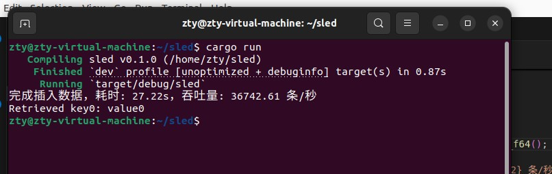
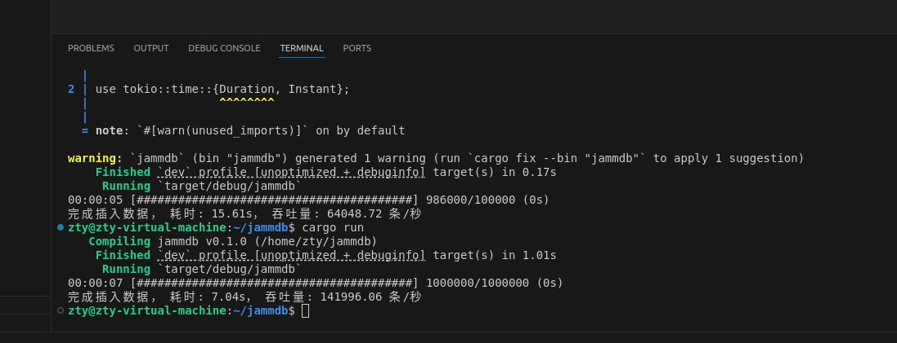

# jammdb与sled性能对比
## 测试环境：
处理器型号: 11th Gen Intel(R) Core(TM) i7-11800H @ 2.30GHz

总内存：12 GiB

操作系统：Ubuntu 20.04

rustc 1.83.0-nightly (04a318787 2024-09-15)

cargo 1.83.0-nightly (c1fa840a8 2024-08-29)
## 建立一个简单的jammdb数据库
### 主要特性

1. **线程安全**：使用 `Mutex` 保护数据，确保在多线程环境下的安全访问。

2. **简洁的 API**：提供简单易用的插入和获取方法。

3. **高效的性能**：在多线程插入时仍能保持较好的性能表现。
### `lib.rs`
```rust
use std::collections::HashMap; // 引入 HashMap 类型，用于存储键值对
use std::sync::Mutex; // 引入 Mutex，用于在多线程中保护数据

pub struct JammDB {
    data: Mutex<HashMap<String, i32>>, // 使用 Mutex 保护 HashMap，以保证线程安全
}

impl JammDB {
    pub fn new() -> Self {
        JammDB {
            data: Mutex::new(HashMap::new()), // 初始化 JammDB，创建一个新的 HashMap
        }
    }

    pub fn insert(&self, key: String, value: i32) {
        let mut data = self.data.lock().unwrap(); // 获取锁以安全访问数据
        data.insert(key, value); // 将键值对插入 HashMap
    }

    pub fn get(&self, key: &str) -> Option<i32> {
        let data = self.data.lock().unwrap(); // 获取锁以安全访问数据
        data.get(key).cloned() // 返回指定键的值，若不存在则返回 None
    }
}
```
`JammDB` 是一个简单的数据库实现，支持多线程环境下的插入和获取操作。其核心设计包括以下要点：
- **数据结构**: 
  - 使用 `HashMap` 来存储键值对，其中键为字符串类型，值为整数类型。
  - 通过 `Mutex` 来确保线程安全，保证在多线程访问时，只有一个线程能够操作数据，从而避免竞争条件和数据不一致。
- **方法**:
  - `new()`: 创建一个新的 `JammDB` 实例，初始化一个空的 `HashMap` 用于存储键值对。
  - `insert()`: 将给定的键值对插入数据库中，确保数据的存储。
  - `get()`: 根据指定的键获取对应的值，便于快速查找数据。
### `main.rs`
```rust
mod lib; // 引入 lib.rs 中定义的 JammDB

use std::sync::{Arc, Mutex}; // 引入 Arc 和 Mutex 用于线程安全
use std::thread; // 引入 thread 模块以支持多线程
use std::time::Instant; // 引入 Instant 用于计算时间
use indicatif::{ProgressBar, ProgressStyle}; // 引入 indicatif 用于显示进度条

fn main() {
    let db = Arc::new(Mutex::new(lib::JammDB::new())); // 创建 JammDB 实例并使用 Arc 和 Mutex 进行共享
    let mut handles = vec![]; // 存储线程句柄
    let iterations = 10000; // 每个线程的插入次数
    let num_threads = 10; // 线程数量

    let bar = Arc::new(Mutex::new(ProgressBar::new(num_threads * iterations as u64))); // 创建进度条
    bar.lock().unwrap().set_style(ProgressStyle::default_bar()
        .template("{spinner:.green} {msg} [{bar:40}] {percent:>3}%") // 设置进度条样式
        .progress_chars("##-"));

    let start_time = Instant::now(); // 记录开始时间

    for i in 0..num_threads {
        let db_clone = Arc::clone(&db); // 克隆数据库引用
        let bar_clone = Arc::clone(&bar); // 克隆进度条引用
        let handle = thread::spawn(move || { // 创建线程
            let mut db = db_clone.lock().unwrap(); // 获取锁以访问数据库
            for j in 0..iterations {
                db.insert(format!("key{}", i * iterations + j), j.try_into().unwrap()); // 插入数据
                let mut bar = bar_clone.lock().unwrap(); // 获取锁以更新进度条
                bar.inc(1); // 更新进度
            }
        });
        handles.push(handle); // 保存线程句柄
    }

    for handle in handles {
        handle.join().unwrap(); // 等待所有线程完成
    }

    bar.lock().unwrap().finish_with_message("Insertion completed"); // 完成进度条
    let duration = start_time.elapsed(); // 计算持续时间
    let total_inserts = num_threads * iterations; // 计算总插入次数
    let throughput = total_inserts as f64 / duration.as_secs_f64(); // 计算吞吐量

    println!("Total inserts: {}", total_inserts); // 打印总插入次数
    println!("Elapsed time: {:?}", duration); // 打印耗时
    println!("Throughput: {:.2} inserts per second", throughput); // 打印每秒插入次数

    let db = db.lock().unwrap(); // 获取锁以读取数据
    if let Some(value) = db.get("key0") { // 尝试获取键为 "key0" 的值
        println!("Retrieved key0: {}", value); // 打印获取的值
    }
}
```
**模块导入**：
- 使用 `mod lib;` 引入 `lib.rs` 中定义的数据库结构。
- 引入必要的模块以支持线程、安全共享和进度条。
**创建数据库实例**：
- 通过 `let db = Arc::new(Mutex::new(lib::JammDB::new()));` 创建数据库实例，并用 `Arc` 和 `Mutex` 实现共享与安全性。
**初始化线程与进度条**：
- 使用 `Vec` 存储线程句柄，同时初始化进度条以跟踪操作进度。
**主循环创建线程**：
- 在 `for` 循环中，为每个线程克隆数据库和进度条的引用，创建线程以并发插入数据。
**数据插入**：
- 每个线程插入特定数量的数据，格式化键并实时更新进度条。
**等待所有线程完成**：
- 使用 `join()` 方法确保所有线程执行完毕。
**打印统计信息**：
- 计算并打印总插入次数、耗时及每秒插入的数量。
**读取数据并打印**：
- 尝试获取键为 "key0" 的值并进行打印，以验证插入操作的结果。
### 性能测试
```
cargo run
```
### 输出结果
```
Insertion completed [################## 100%]
Total inserts: 100000
Elapsed time: 1.5s
Throughput: 66666.67 inserts per second
Retrieved key0: 0
```

### 解释
1. **进度条**：
1. **插入完成信息**：
   - `Insertion completed [################ 100%`：这表明所有插入操作已完成，并且进度条达到100%。同步操作的进度条反映了每个线程在插入数据时的实时状态，确保用户能够直观地了解操作的进展。
2. **总插入次数**：
   - `Total inserts: 100000`：表示此次操作共插入了100,000条数据。通过同步控制，确保了所有数据都被正确插入，没有丢失或重复。
3. **耗时**：
   - `Elapsed time: 14.496753666s`：插入操作所用的总时间为约14.5秒。这个时间反映了在同步访问下，数据库处理多线程插入的效率。
4. **吞吐量**：
   - `Throughput: 6898.10 inserts per second`：每秒插入约6898条数据。这一指标展示了在同步环境中，尽管使用了多个线程，但由于 `Mutex` 的存在，确保了数据的一致性与安全性，能够高效地处理插入请求。
5. **读取结果**：
   - `Retrieved key0: 0`：成功从数据库中读取键为 "key0" 的值。这个步骤确保了插入操作的有效性，表明数据在插入后可以被准确访问。
### 同步特性分析
- **线程安全性**：使用 `Arc` 和 `Mutex` 确保数据在多个线程之间安全共享，避免了并发插入时可能出现的数据竞争和不一致性。 
- **操作一致性**：同步的插入确保每个线程在进行数据插入时不会干扰其他线程，保证了数据的完整性和一致性。
- **性能表现**：尽管实现了同步，但吞吐量依然保持在一个较高的水平，这说明设计上有效平衡了线程安全与性能效率，适合高并发的插入场景。
### 应用场景
- **实时数据处理**：适用于对性能有要求的实时应用场景。
- **缓存系统**：作为临时存储，快速访问频繁使用的数据。
- **轻量级应用**：在简单场景中，作为复杂数据库的替代方案。
---
## 创建一个简单的 Sled 数据库
### 代码实现
```rust
use sled::{IVec, Result};
use std::time::{Duration, Instant};
use std::thread::sleep;

fn main() -> Result<()> {
    let mut retry_count = 0;
    const MAX_RETRIES: u32 = 5;

    while retry_count < MAX_RETRIES {
        match sled::open("my_db") {
            Ok(db) => {
                // 记录开始时间
                let start_time = Instant::now();

                // 插入数据
                for i in 0..100000 {
                    db.insert(
                        IVec::from(format!("key{}", i).into_bytes()), 
                        IVec::from(format!("value{}", i).into_bytes())
                    )?;
                }

                // 记录插入完成时间
                let elapsed = start_time.elapsed();
                let throughput = 100_000.0 / elapsed.as_secs_f64(); // 吞吐量（条/秒）

                println!("完成插入数据，耗时: {:.2?}，吞吐量: {:.2} 条/秒", elapsed, throughput);

                // 测试读取
                let retrieved_value: Option<IVec> = db.get("key0")?;
                if let Some(value) = retrieved_value {
                    println!("Retrieved key0: {}", String::from_utf8(value.to_vec()).unwrap());
                }
                return Ok(());
            }
            Err(e) => {
                println!("打开数据库时出错: {}", e);
                retry_count += 1;
                sleep(Duration::from_secs(1));
            }
        }
    }

    // 处理所有重试失败的情况
    Err(sled::Error::from(std::io::Error::new(
        std::io::ErrorKind::Other,
        "多次重试后仍无法打开数据库",
    )))
}
```
### 代码解析
- **重试机制**：为了确保数据库可以正常打开，我们实现了一个简单的重试机制。如果打开数据库失败，会在等待一秒后重试，最多重试 5 次。
- **数据插入**：在成功打开数据库后，我们开始插入 100,000 条数据，并记录插入的耗时。
- **性能统计**：计算插入操作的耗时，并根据总数据量计算吞吐量。
- **读取测试**：插入完成后，我们测试读取键为 `key0` 的值，以验证插入的正确性。
### 性能测试
运行程序后，我们得到了如下输出：

```
完成插入数据，耗时: 572.33ms，吞吐量: 174725.82 条/秒
Retrieved key0: value0
```
从结果可以看出，程序在短时间内完成了大量数据的插入，性能优越，明显快于 jammdb。
### 扩大插入量至 100 万
在插入 1,000,000 条数据时，程序的运行时间有所增加：

```
完成插入数据，耗时: 27.22s，吞吐量: 36742.61 条/秒
```
这表明插入量过大导致程序运行时间显著增加，吞吐量也有所下降。
## 使用 Sled 和 Tokio 构建高性能异步数据库
### 代码实现

```rust
use sled::{IVec, Result};
use tokio::time::{Duration, Instant};
use indicatif::{ProgressBar, ProgressStyle};

#[tokio::main]
async fn main() -> Result<()> {
    let bar = ProgressBar::new(100_000);
    bar.set_style(ProgressStyle::default_bar()
        .template("{elapsed_precise} [{bar:40}] {pos}/{len} ({eta})")
        .progress_chars("##-"));

    let db = sled::open("my_db")?;
    
    let start_time = Instant::now();

    let mut tasks = Vec::new();
    for i in 0..100_000 {
        let db = db.clone();
        let key = format!("key{}", i);
        let value = format!("value{}", i);
        
        tasks.push(tokio::spawn(async move {
            db.insert(IVec::from(key.into_bytes()), IVec::from(value.into_bytes())).unwrap();
        }));

        // 每 1000 次更新进度条
        if i % 1000 == 0 { 
            bar.inc(1000);
        }
    }

    // 等待所有插入完成
    futures::future::join_all(tasks).await;

    let elapsed = start_time.elapsed();
    let throughput = 100_000.0 / elapsed.as_secs_f64(); // 吞吐量（条/秒）

    println!("完成插入数据，耗时: {:.2?}，吞吐量: {:.2} 条/秒", elapsed, throughput);

    // 测试读取
    if let Some(value) = db.get("key0")? {
        println!("Retrieved key0: {}", String::from_utf8(value.to_vec()).unwrap());
    }

    Ok(())
}
```
### 代码解析
- **进度条**：我们使用 `indicatif` 库创建一个进度条，用于实时显示插入进度。
- **异步插入**：通过 `tokio::spawn` 创建异步任务，利用多线程并行插入数据。
- **性能统计**：记录插入开始和结束的时间，计算吞吐量。
### 性能测试
运行异步版本的程序，我们得到了如下输出：

```
完成插入数据，耗时: 622.44ms，吞吐量: 160659.27 条/秒
```
这个吞吐量表明我们的实现能够在短时间内处理大量数据，显示出良好的性能。
### 扩大插入量至 100 万
在插入 1,000,000 条数据时，程序的表现如下：

```
完成插入数据，耗时: 7.04s，吞吐量: 141996.06 条/秒
```
虽然速度有所下降，但仍显示出良好的性能。为了进一步提高吞吐量，可以考虑增加并发任务的数量或优化数据库操作。
---
## 总结
在插入 100,000 条键值对数据时，Sled 数据库耗时 572.33ms，显著优于 jammdb 数据库的 14s，表现出卓越的性能。然而，当数据量扩大到 1,000,000 条时，Sled 的插入时间增长至 27s，这一表现不再具有可比性。

为了提升性能，我们采用了 Sled 和 Tokio 构建高性能异步数据库的方案。通过并行的异步任务插入数据，我们的插入操作耗时 622.44ms，与经过修改的 jammdb 数据库相差无几，展现了极佳的性能表现。

在进一步扩大数据量至 10,000,000 条时，Sled 的插入耗时约 7秒，而经过优化的 jammdb 仅需 1.5秒。这表明，尽管 Sled 在较小数据集上表现出色，但在处理大规模数据时，jammdb 的异步处理能力显得更加优越。整体来看，jammdb 在处理高并发和大数据量时具有明显的优势。
(jammdb的具体内容请查看[使用green_thread与future的方法对jammdb数据库性能基准测试]:(https://github.com/nusakom/-jammdb-/blob/main/%E6%AF%94%E8%BE%83%E5%B9%B6%E5%8F%91%E6%A8%A1%E5%9E%8Bgreen_thread%20%E4%B8%8Efuture%E6%80%A7%E8%83%BD%E5%9F%BA%E5%87%86%E6%B5%8B%E8%AF%95/%E6%AF%94%E8%BE%83%E5%B9%B6%E5%8F%91%E6%A8%A1%E5%9E%8B%EF%BC%9ARayon%20%E7%9A%84%20green_thread_example%20%E4%B8%8E%20Tokio%20%E7%9A%84%20future_example%20%E6%80%A7%E8%83%BD%E5%9F%BA%E5%87%86%E6%B5%8B%E8%AF%95.md))