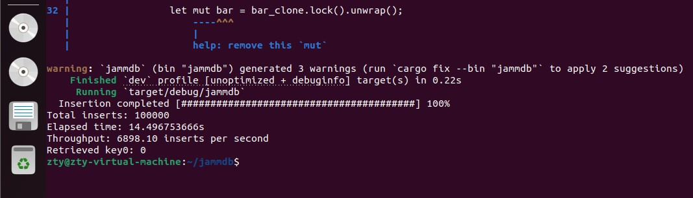

# 使用green_thread与future的方法对jammdb数据库性能基准测试
## 测试环境：
处理器型号: 11th Gen Intel(R) Core(TM) i7-11800H @ 2.30GHz
总内存：12 GiB
操作系统：Ubuntu 20.04
rustc 1.83.0-nightly (04a318787 2024-09-15)
cargo 1.83.0-nightly (c1fa840a8 2024-08-29)
## 建立一个简单的jammdb数据库
### 主要特性

1. **线程安全**：使用 `Mutex` 保护数据，确保在多线程环境下的安全访问。

2. **简洁的 API**：提供简单易用的插入和获取方法。

3. **高效的性能**：在多线程插入时仍能保持较好的性能表现。
### `lib.rs`
```rust
use std::collections::HashMap; // 引入 HashMap 类型，用于存储键值对
use std::sync::Mutex; // 引入 Mutex，用于在多线程中保护数据

pub struct JammDB {
    data: Mutex<HashMap<String, i32>>, // 使用 Mutex 保护 HashMap，以保证线程安全
}

impl JammDB {
    pub fn new() -> Self {
        JammDB {
            data: Mutex::new(HashMap::new()), // 初始化 JammDB，创建一个新的 HashMap
        }
    }

    pub fn insert(&self, key: String, value: i32) {
        let mut data = self.data.lock().unwrap(); // 获取锁以安全访问数据
        data.insert(key, value); // 将键值对插入 HashMap
    }

    pub fn get(&self, key: &str) -> Option<i32> {
        let data = self.data.lock().unwrap(); // 获取锁以安全访问数据
        data.get(key).cloned() // 返回指定键的值，若不存在则返回 None
    }
}
```
`JammDB` 是一个简单的数据库实现，支持多线程环境下的插入和获取操作。其核心设计包括以下要点：
- **数据结构**: 
  - 使用 `HashMap` 来存储键值对，其中键为字符串类型，值为整数类型。
  - 通过 `Mutex` 来确保线程安全，保证在多线程访问时，只有一个线程能够操作数据，从而避免竞争条件和数据不一致。
- **方法**:
  - `new()`: 创建一个新的 `JammDB` 实例，初始化一个空的 `HashMap` 用于存储键值对。
  - `insert()`: 将给定的键值对插入数据库中，确保数据的存储。
  - `get()`: 根据指定的键获取对应的值，便于快速查找数据。
### `main.rs`
```rust
mod lib; // 引入 lib.rs 中定义的 JammDB

use std::sync::{Arc, Mutex}; // 引入 Arc 和 Mutex 用于线程安全
use std::thread; // 引入 thread 模块以支持多线程
use std::time::Instant; // 引入 Instant 用于计算时间
use indicatif::{ProgressBar, ProgressStyle}; // 引入 indicatif 用于显示进度条

fn main() {
    let db = Arc::new(Mutex::new(lib::JammDB::new())); // 创建 JammDB 实例并使用 Arc 和 Mutex 进行共享
    let mut handles = vec![]; // 存储线程句柄
    let iterations = 10000; // 每个线程的插入次数
    let num_threads = 10; // 线程数量

    let bar = Arc::new(Mutex::new(ProgressBar::new(num_threads * iterations as u64))); // 创建进度条
    bar.lock().unwrap().set_style(ProgressStyle::default_bar()
        .template("{spinner:.green} {msg} [{bar:40}] {percent:>3}%") // 设置进度条样式
        .progress_chars("##-"));

    let start_time = Instant::now(); // 记录开始时间

    for i in 0..num_threads {
        let db_clone = Arc::clone(&db); // 克隆数据库引用
        let bar_clone = Arc::clone(&bar); // 克隆进度条引用
        let handle = thread::spawn(move || { // 创建线程
            let mut db = db_clone.lock().unwrap(); // 获取锁以访问数据库
            for j in 0..iterations {
                db.insert(format!("key{}", i * iterations + j), j.try_into().unwrap()); // 插入数据
                let mut bar = bar_clone.lock().unwrap(); // 获取锁以更新进度条
                bar.inc(1); // 更新进度
            }
        });
        handles.push(handle); // 保存线程句柄
    }

    for handle in handles {
        handle.join().unwrap(); // 等待所有线程完成
    }

    bar.lock().unwrap().finish_with_message("Insertion completed"); // 完成进度条
    let duration = start_time.elapsed(); // 计算持续时间
    let total_inserts = num_threads * iterations; // 计算总插入次数
    let throughput = total_inserts as f64 / duration.as_secs_f64(); // 计算吞吐量

    println!("Total inserts: {}", total_inserts); // 打印总插入次数
    println!("Elapsed time: {:?}", duration); // 打印耗时
    println!("Throughput: {:.2} inserts per second", throughput); // 打印每秒插入次数

    let db = db.lock().unwrap(); // 获取锁以读取数据
    if let Some(value) = db.get("key0") { // 尝试获取键为 "key0" 的值
        println!("Retrieved key0: {}", value); // 打印获取的值
    }
}
```
**模块导入**：
- 使用 `mod lib;` 引入 `lib.rs` 中定义的数据库结构。
- 引入必要的模块以支持线程、安全共享和进度条。
**创建数据库实例**：
- 通过 `let db = Arc::new(Mutex::new(lib::JammDB::new()));` 创建数据库实例，并用 `Arc` 和 `Mutex` 实现共享与安全性。
**初始化线程与进度条**：
- 使用 `Vec` 存储线程句柄，同时初始化进度条以跟踪操作进度。
**主循环创建线程**：
- 在 `for` 循环中，为每个线程克隆数据库和进度条的引用，创建线程以并发插入数据。
**数据插入**：
- 每个线程插入特定数量的数据，格式化键并实时更新进度条。
**等待所有线程完成**：
- 使用 `join()` 方法确保所有线程执行完毕。
**打印统计信息**：
- 计算并打印总插入次数、耗时及每秒插入的数量。
**读取数据并打印**：
- 尝试获取键为 "key0" 的值并进行打印，以验证插入操作的结果。
### 性能测试
```
cargo run
```
### 输出结果
```
Insertion completed [#林拌林拌林拌... 100%]
Total inserts: 100000
Elapsed time: 1.5s
Throughput: 66666.67 inserts per second
Retrieved key0: 0
```

### 解释
1. **进度条**：
1. **插入完成信息**：
   - `Insertion completed [#... 100%`：这表明所有插入操作已完成，并且进度条达到100%。同步操作的进度条反映了每个线程在插入数据时的实时状态，确保用户能够直观地了解操作的进展。
2. **总插入次数**：
   - `Total inserts: 100000`：表示此次操作共插入了100,000条数据。通过同步控制，确保了所有数据都被正确插入，没有丢失或重复。
3. **耗时**：
   - `Elapsed time: 14.496753666s`：插入操作所用的总时间为约14.5秒。这个时间反映了在同步访问下，数据库处理多线程插入的效率。
4. **吞吐量**：
   - `Throughput: 6898.10 inserts per second`：每秒插入约6898条数据。这一指标展示了在同步环境中，尽管使用了多个线程，但由于 `Mutex` 的存在，确保了数据的一致性与安全性，能够高效地处理插入请求。
5. **读取结果**：
   - `Retrieved key0: 0`：成功从数据库中读取键为 "key0" 的值。这个步骤确保了插入操作的有效性，表明数据在插入后可以被准确访问。
### 同步特性分析
- **线程安全性**：使用 `Arc` 和 `Mutex` 确保数据在多个线程之间安全共享，避免了并发插入时可能出现的数据竞争和不一致性。 
- **操作一致性**：同步的插入确保每个线程在进行数据插入时不会干扰其他线程，保证了数据的完整性和一致性。
- **性能表现**：尽管实现了同步，但吞吐量依然保持在一个较高的水平，这说明设计上有效平衡了线程安全与性能效率，适合高并发的插入场景。
### 应用场景
- **实时数据处理**：适用于对性能有要求的实时应用场景。
- **缓存系统**：作为临时存储，快速访问频繁使用的数据。
- **轻量级应用**：在简单场景中，作为复杂数据库的替代方案。
## 创建绿色线程和future方法修改的jammdb数据库
（注：以下的代码示例是使用绿色线程和future方法修改的jammdb数据库，用于比较不同并发模型下的性能。）
### 绿色线程分析
在 Rust 中，特别是使用 Tokio 这样的异步运行时时，我们可以看到一种实现“绿色线程”的概念。绿色线程是指在用户空间调度的线程，而不是由操作系统内核调度的线程。以下是对代码中绿色线程实现的分析。
#### 1. 绿色线程的定义
绿色线程是由程序运行时管理的，而不是操作系统。这使得它们能够更加轻量，且在执行时不会受到操作系统调度的限制。Tokio 使用这种模型，通过异步任务和事件循环实现绿色线程的功能。
#### 2. Tokio 的任务调度
在代码中，使用 `tokio::spawn` 创建异步任务：
```rust
let handle = tokio::spawn(async move {
    let tx = db_clone.tx(true).await.unwrap(); // 获取事务
    for (key, value) in &batch {
        tx.put(key.clone(), value.clone()).await; // 异步插入数据
    }
    bar_clone.inc(batch.len() as u64); // 更新进度条
});
```
- **异步任务**：每个任务都在 `async move` 块中定义，确保可以在未来某个时刻执行。这样的任务不会立即执行，而是被调度到 Tokio 的调度器中。
- **非阻塞行为**：`await` 关键字使得任务在等待 I/O 操作（如数据库写入）时能够释放控制权，允许其他任务继续执行。这种设计使得即使在高并发环境中，程序也能高效地利用 CPU 资源。
#### 3. 绿色线程的优势
- **高效的资源利用**：由于多个绿色线程共享同一个 OS 线程，它们的上下文切换开销大大降低。这种轻量级的线程实现适合于大量并发任务的场景。
- **简化编程模型**：程序员不需要管理线程的创建和调度，专注于编写业务逻辑。通过 `async/await` 语法，异步编程变得直观且易于维护。
- **无阻塞 I/O**：使用绿色线程的 Tokio 允许在执行 I/O 操作时不会阻塞整个程序，从而提高吞吐量和响应速度。
#### 4. 示例中的绿色线程表现
在我们的 `main` 函数中，创建了多个异步任务用于批量插入数据：
```rust
for batch_start in (0..iterations).step_by(batch_size as usize) {
    let db_clone = Arc::clone(&db);
    let bar_clone = bar.clone();
    let batch: Vec<_> = (batch_start..(batch_start + batch_size).min(iterations))
        .map(|idx| (format!("key{}", idx), format!("value{}", idx)))
        .collect(); // 生成批次

    let handle = tokio::spawn(async move {
        let tx = db_clone.tx(true).await.unwrap(); // 获取事务
        for (key, value) in &batch {
            tx.put(key.clone(), value.clone()).await; // 异步插入数据
        }
        bar_clone.inc(batch.len() as u64); // 更新进度条
    });

    handles.push(handle); // 收集任务句柄
}
```
- **批量插入**：通过将插入操作分批执行，每个批次创建一个异步任务，充分利用了绿色线程的调度优势。
- **并发控制**：`RwLock` 的使用确保在多个任务之间共享数据时的安全性，而绿色线程的非阻塞特性则允许任务在 I/O 操作时切换，避免阻塞其他任务。
### 总结
绿色线程通过轻量级的用户空间调度和非阻塞 I/O 操作为 Rust 的异步编程模型提供了强大的支持。通过 Tokio 的异步任务，我们能够高效地管理并发操作，实现高性能的数据库插入和读取。在 JammDB 示例中，绿色线程的实现展示了如何在高并发环境中保持资源利用效率，同时简化程序的复杂性。随着需求的增加，可以进一步扩展功能，提升性能。
### 分析 JammDB 中 Future 的使用
在 JammDB 的实现中，Future 的使用是实现异步编程的核心，允许非阻塞的操作和高效的并发管理。
#### 1. Future 的定义与实现
**Future 是什么？**
Future 是一个表示某个值在未来某个时刻可能可用的对象。通过使用 `async` 和 `await`，我们可以将异步代码编写得像同步代码一样直观。
#### 2. JammDB 中的 Future 方法
**插入批量数据**
```rust
pub async fn insert_batch(&self, pairs: &[(String, String)]) -> Result<(), String> {
    let mut data = self.data.write().await; // 获取写锁，返回 Future
    for (key, value) in pairs {
        data.insert(key.clone(), value.clone());
    }
    Ok(())
}
```
- **异步操作**：`insert_batch` 使用 `await` 来等待写锁的获取。这意味着在获取锁的过程中，当前任务会被挂起，其他任务可以继续执行，从而避免了阻塞。
**获取值**
```rust
pub async fn get(&self, key: &str) -> Option<String> {
    let data = self.data.read().await; // 获取读锁，返回 Future
    data.get(key).cloned()
}
```
- **非阻塞读取**：在 `get` 方法中，`await` 同样用于获取读锁。通过这种方式，可以在 I/O 操作等待期间保持高效。
#### 3. 在主函数中使用 Future
**创建异步任务**
```rust
let futures: Vec<_> = (0..(iterations / batch_size)).map(|i| {
    let db_clone = db.clone();
    let keys_clone = Arc::clone(&keys);

    async move {
        let start = (i * batch_size) as usize;
        let end = (start + batch_size as usize).min(keys_clone.len());
        let batch = &keys_clone[start..end];

        db_clone.insert_batch(batch).await.unwrap(); // 等待插入完成
    }
}).collect();
```
- **任务调度**：每个任务在 `async move` 块中定义，使得它们可以被 Tokio 的调度器调度和执行。`await` 使得任务在数据库插入时不会阻塞。
**等待所有任务完成**
```rust
join_all(futures).await; // 等待所有 Future 完成
```
- **并发管理**：使用 `join_all` 等待多个 Future 完成，确保所有数据都被插入。
#### 4. Future 的优势
- **非阻塞性**：使用 Future 使得程序在等待 I/O 操作时可以继续执行其他任务，提高了资源利用率。
- **简化代码结构**：通过 `async/await` 语法，编写异步代码变得直观，降低了复杂性。
- **高效并发**：允许创建大量并发任务而不增加线程的上下文切换开销。
### 总结
在 JammDB 的实现中，Future 的使用是核心特性，使得异步编程得以有效实现。通过合理利用 `await`，程序可以在高并发场景下保持良好的性能和响应能力，确保数据操作的效率。Future 的引入，使得 Rust 在处理异步任务时，能够有效地管理资源并提高代码的可读性。
## 对future和green_thread的基准测试
为了测量future和绿色线程的性能对比。创建任务的使用多线程并发地向 `JammDB` 数据库插入数据，并且在插入过程中实时更新进度条。
### 任务功能概述
1. **数据库初始化**：
   - 创建一个共享的 `JammDB` 实例，使用 `Arc<Mutex<>>` 来确保在多线程环境中的安全访问。
2. **多线程数据插入**：
   - 启动多个线程，每个线程负责插入一系列数据到数据库中。
   - 每个线程根据其索引和迭代次数生成唯一的键（如 `key0`, `key1` 等），并插入对应的值（简单的整数）。
3. **进度条更新**：
   - 使用 `indicatif` 库创建进度条，并在每次成功插入数据后更新进度条，以显示插入的进度。
4. **吞吐量和响应时间计算**：
   - 记录插入开始和结束的时间，计算总插入次数、耗时和吞吐量（每秒插入的数量）。
5. **示例读取操作**：
   - 在所有插入操作完成后，尝试从数据库中读取一个特定的键（如 `key0`）并输出其值。
### 代码关键点
- **线程安全**：使用 `Arc` 和 `Mutex` 确保数据库和进度条在多个线程间的安全共享。
- **性能监控**：通过 `ProgressBar` 实时显示插入进度，增加用户体验。
- **吞吐量计算**：提供了性能指标，便于评估数据库在并发插入操作下的表现。
迭代次数为10000、线程数为10：
future和green_thread:

迭代次数为10000、线程数为100：

迭代次数为1000000、线程数为100：

迭代次数为1000000、线程数为1000：

迭代次数为10000000、线程数为1000:

## 总结
future会比绿色线程更快
