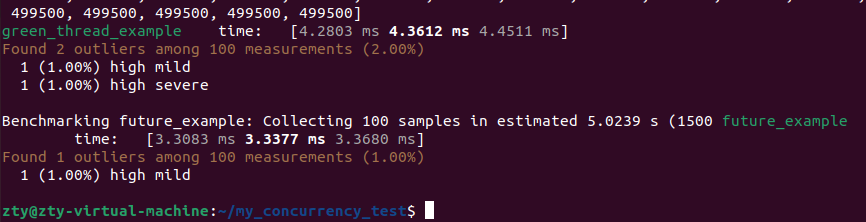

# 比较并发模型：Rayon 的 green_thread_example 与 Tokio 的 future_example 性能基准测试
在现代编程中，处理并发任务是一项常见且重要的需求。在 Rust 中，Rayon 和 Tokio 是两个流行的并发库，分别用于数据并行处理和异步编程。本文将通过基准测试对比这两种并发模型的性能，以帮助开发者选择合适的工具来优化他们的应用程序。

## 并发模型介绍
Rayon 的 green_thread_example
Rayon 是一个用于数据并行的库，它使得在多核处理器上并行执行任务变得简单。下面是 green_thread_example 的代码示例：
```
use rayon::prelude::*;
use std::time::Instant;

fn green_thread_example() {
    let start = Instant::now();

    (0..1000).into_par_iter().for_each(|_| {
        // 模拟耗时任务
        std::thread::sleep(std::time::Duration::from_millis(5));
    });

    let duration = start.elapsed();
    println!("Green Thread Example took {:?}", duration);
}
```
### 代码解释:

rayon::prelude::*：导入 Rayon 的并发工具。
(0..1000).into_par_iter().for_each(...)：将一个范围转换为并行迭代器，并对每个元素执行闭包中的任务。
std::thread::sleep(std::time::Duration::from_millis(5))：模拟每个任务需要 5 毫秒来完成。
Tokio 的 future_example
Tokio 是一个用于异步编程的库，它提供了一个异步运行时，用于处理大量的异步操作。下面是 future_example 的代码示例：
```
use tokio::time::Duration;
use tokio::runtime::Runtime;

async fn future_example() {
    let rt = Runtime::new().unwrap();

    let start = std::time::Instant::now();

    rt.block_on(async {
        let tasks: Vec<_> = (0..1000).map(|_| {
            tokio::spawn(async {
                // 模拟耗时任务
                tokio::time::sleep(Duration::from_millis(5)).await;
            })
        }).collect();

        for task in tasks {
            task.await.unwrap();
        }
    });

    let duration = start.elapsed();
    println!("Future Example took {:?}", duration);
}
```
### 代码解释:

tokio::time::Duration 和 tokio::runtime::Runtime：导入 Tokio 的异步工具。
rt.block_on(async { ... })：在 Tokio 运行时内执行异步代码。
tokio::spawn(async { ... })：在异步上下文中启动一个任务。
tokio::time::sleep(Duration::from_millis(5)).await：模拟每个异步任务需要 5 毫秒来完成。
## 基准测试结果分析

### green_thread_example 性能
执行时间: green_thread_example 的基准测试结果为 4.2803 毫秒到 4.4511 毫秒之间。
离群值: 测试中发现了 2 个离群值，占 2%。其中 1 个是高轻度，1 个是高严重。这些离群值可能由于系统负载波动或其他外部因素引起。
### future_example 性能
执行时间: future_example 的基准测试结果为 3.3083 毫秒到 3.3680 毫秒之间。
离群值: 测试中发现了 1 个离群值，占 1%，为高轻度。这表明 future_example 在绝大多数情况下表现稳定，并且相对于 green_thread_example 更具优势。
## 性能比较
从基准测试结果来看，future_example 的性能优于 green_thread_example，其平均执行时间低于 green_thread_example。这可能是因为异步编程模型在处理短时间任务时更为高效，而 Rayon 在创建和管理线程时可能带来了额外的开销。

## 选择合适的并发模型
Rayon: 适用于数据并行任务，当任务的计算量大并且能够充分利用多核处理器时，Rayon 是一个不错的选择。
Tokio: 适用于需要处理大量异步 I/O 操作的任务。如果应用需要高效的异步操作来提高响应速度，Tokio 是更好的选择。
## 结论
通过基准测试，我们可以看到 Tokio 的异步编程模型在处理大量短时间任务时比 Rayon 的数据并行模型表现更好。然而，选择哪种并发模型还应考虑具体应用的需求和特性。希望这次的性能对比能为你的项目选择合适的并发工具提供参考。

代码地址：https://github.com/nusakom/my_concurrency_test