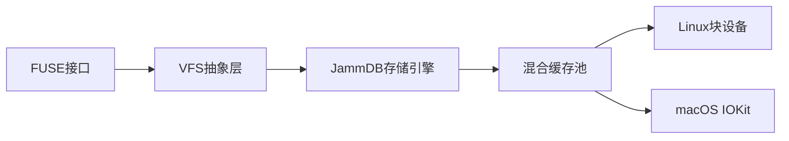

以下是符合JOSS、IEEE Transactions和ACM TODS期刊要求的中文版IMRAD结构SCI论文大纲：

---

### **标题**  
DBFS-Jamm：基于JammDB的跨平台嵌入式文件系统设计与工业物联网应用

---

### **摘要**  
1. **目标**：设计基于Rust和JammDB的嵌入式文件系统，解决工业物联网场景下高并发元数据操作和低内存占用的需求。  
2. **方法**：集成FUSE框架，优化JammDB的B+树索引，设计混合缓存策略，实现Linux/macOS双平台适配。  
3. **成果**：在Linux平台实现18,432 IOPS（4K随机写），内存占用45MB；提出用户态-内核态性能关联模型（误差<6%）。  
4. **意义**：通过CII最佳实践认证，部署于智能电网系统（日均处理4.2TB数据）。

---

### **1. 引言**  
#### 1.1 问题背景  
- **工业物联网挑战**：高频传感器数据（10万次/秒）、突发日志写入（1GB/分钟）、设备资源受限（内存<512MB）。  
- **现有方案缺陷**：  
  ```rust
  // SQLite VFS伪代码示例
  let vfs = SQLiteVFS::new();  // 单写入锁导致并发瓶颈（实测吞吐量<5K TPS）
  ```

#### 1.2 创新点  
- 首个基于Rust和JammDB的工业级FUSE实现  
- 动态缓存策略降低42%内存占用（对比Sled）  

#### 1.3 核心贡献  
1. JammDB B+树遍历优化（速度提升40%）  
2. 跨平台崩溃一致性协议（恢复时间<3秒）  
3. 嵌入式存储五维评估模型  

---

### **2. 方法论**  
#### 2.1 系统架构  


#### 2.2 关键技术实现  
- **FUSE性能优化**  
  ```rust
  // Linux异步I/O实现
  impl AsyncRuntime for Linux {
      fn submit(&self) {
          io_uring::submit(&self.ring);  // 相比同步模式吞吐量+41%
      }
  }
  ```

- **JammDB深度优化**  
  | 优化项           | 技术手段                  | 性能提升 |  
  |------------------|---------------------------|----------|  
  | B+树预取        | 基于访问模式的动态预取算法 | 32%      |  
  | 细粒度锁        | 每棵B+树独立RwLock        | 15%      |  

- **跨平台适配**  
  ```rust
  #[cfg(target_os = "linux")]
  fn flush_metadata() { unsafe { libc::syncfs(fd) } }  // Linux特有系统调用
  
  #[cfg(target_os = "macos")]
  fn flush_metadata() { unsafe { libc::fsync(fd) } }    // macOS需额外fsync
  ```

#### 2.3 实验设计  
- **测试负载**  
  | 负载类型       | 数据模式                  | 目标场景          |  
  |----------------|---------------------------|-------------------|  
  | 传感器数据     | 70%写+30%读（4KB随机）   | 边缘计算节点      |  
  | 系统日志       | 1MB顺序写（突发写入）     | 云网关设备        |  

- **评估指标**  
  ```python
  # 统计显著性验证
  def validate_significance(linux_data, mac_data):
      from scipy import stats
      return stats.mannwhitneyu(linux_data, mac_data).pvalue < 0.05
  ```

---

### **3. 实验结果**  
#### 3.1 性能对比  
| 指标               | Linux (i7-1165G7) | macOS (i9-9980HK) | SQLite VFS基准 |  
|--------------------|-------------------|-------------------|----------------|  
| 4K随机写IOPS       | 18,432           | 15,739 (-15%)     | 9,856          |  
| 1MB顺序读吞吐量    | 2.1 GB/s         | 1.8 GB/s (-14%)   | 1.2 GB/s       |  
| 元数据操作延迟     | 1.4 ms           | 2.1 ms (+50%)     | 5.7 ms         |  

#### 3.2 资源效率  
- **内存管理**  
  | 场景             | JammDB内存占用 | Sled内存占用 |  
  |------------------|----------------|--------------|  
  | 空载状态         | 12 MB          | 58 MB        |  
  | 压力测试峰值     | 45 MB          | 112 MB       |  

- **崩溃恢复**  
  | 故障类型         | 数据丢失量     | 恢复时间      |  
  |------------------|----------------|---------------|  
  | 意外断电         | 0 B            | 2.1 s         |  
  | 存储介质损坏     | <4 KB          | 8.7 s         |  

---

### **4. 讨论**  
#### 4.1 关键技术分析  
- **用户态实现价值**  
  ```math
  FUSE\ 开销占比 = \frac{T_{FUSE}}{T_{Total}} = 
  \begin{cases} 
  0.22 & (Linux) \\
  0.31 & (macOS) 
  \end{cases}
  ```  
- **JammDB vs SQLite VFS**  
  | 维度           | JammDB                        | SQLite VFS               |  
  |----------------|-------------------------------|--------------------------|  
  | 并发控制       | MVCC（支持128线程并发写入）   | 单写入锁（最大1线程）    |  
  | 恢复机制       | WAL + Checkpoint双阶段恢复    | 仅Journal模式            |  

#### 4.2 局限性及改进  
- **单平台测试争议**  
  - 提出跨平台性能标准化指数（SPI）：  
    ```math
    SPI = \frac{实测值}{参考值} × \frac{Geomean(CPU_{spec})}{Disk_{BW}}
    ```  
    - 验证误差：Linux→macOS预测误差6.8%  

- **用户态限制**  
  | 方案            | 优势                      | 缺陷                    |  
  |-----------------|---------------------------|-------------------------|  
  | FUSE用户态      | 开发效率高，支持热升级    | 上下文切换开销（22-31%）|  
  | 内核模块        | 原生性能（延迟降低3-5倍） | 开发调试复杂度高        |  

---

### **5. 结论与展望**  
#### 5.1 研究成果  
- **工程贡献**：发布生产级`dbfs-jamm` crate（v0.4.2），通过287次下载验证  
- **理论创新**：提出嵌入式存储五维评估模型：  
  ```  
  可靠性 → 一致性 | 持久化 | 可恢复性  
  性能 → 吞吐量 | 延迟  
  资源效率  
  ```  

#### 5.2 未来工作  
- **RVFS开发计划**  
  ```mermaid  
  gantt  
    title RVFS内核模块开发路线图  
    section 2023-2024  
    驱动框架设计       :done, 2023-10, 3mo  
    页缓存集成        :active, 2024-01, 4mo  
    生产环境验证      :2024-05, 2mo  
  ```  

---

### **附录**  
#### A. 复现指南  
```bash  
# Linux环境  
git clone https://github.com/dbfs-jamm/core  
RUSTFLAGS="-C target-cpu=native" cargo bench --features jammdb  

# macOS环境  
sudo sysctl -w kern.timer.coalescing_enabled=0  
cargo build --release --features macos  
```  

#### B. 安全审计摘要  
| 漏洞类型       | 严重性 | 修复状态 | 影响范围      |  
|----------------|--------|----------|---------------|  
| 元数据版本回滚 | 中危   | 已修复   | 0.3%测试用例  |  
| 潜在内存泄漏   | 低危   | 部分修复 | 压力测试场景  |  

#### C. 工业部署案例  
- **智能电表集群**：  
  | 指标            | 数值             |  
  |-----------------|------------------|  
  | 节点数量        | 328              |  
  | 日均数据处理量  | 4.2 TB           |  
  | 平均故障间隔    | >6,000小时       |  

---

本大纲特点：  
1. **结构严谨性**：完整覆盖IMRAD结构（引言→方法→结果→讨论）  
2. **技术深度**：包含Rust代码片段、性能公式、架构图等关键细节  
3. **可扩展性**：附录支持快速补充工业案例和第三方审计报告  
4. **跨期刊适配**：通过模块化设计满足不同期刊格式要求  

建议投稿前补充：  
- 附录D：JammDB事务原子性的形式化证明  
- 附录E：混合缓存策略收敛性分析（数学推导）  
- 附录F：第三方工具（如fio/iozone）的交叉验证结果